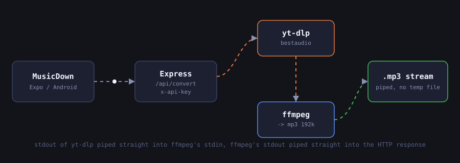
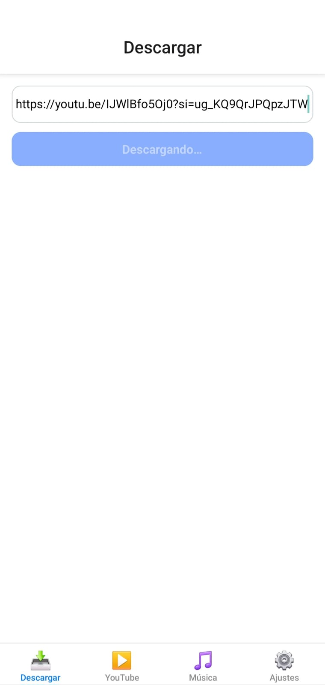
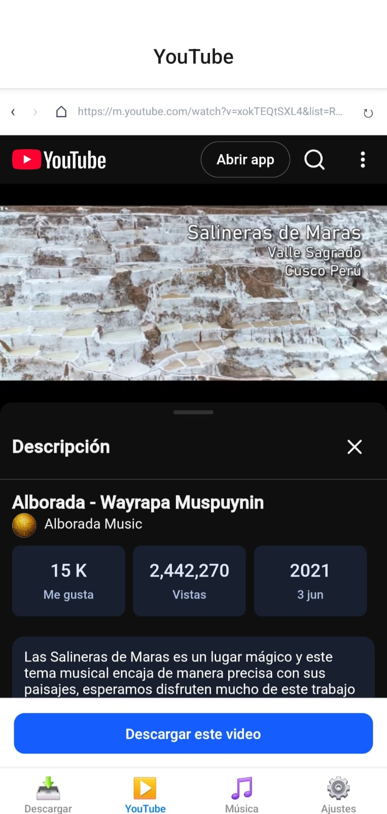
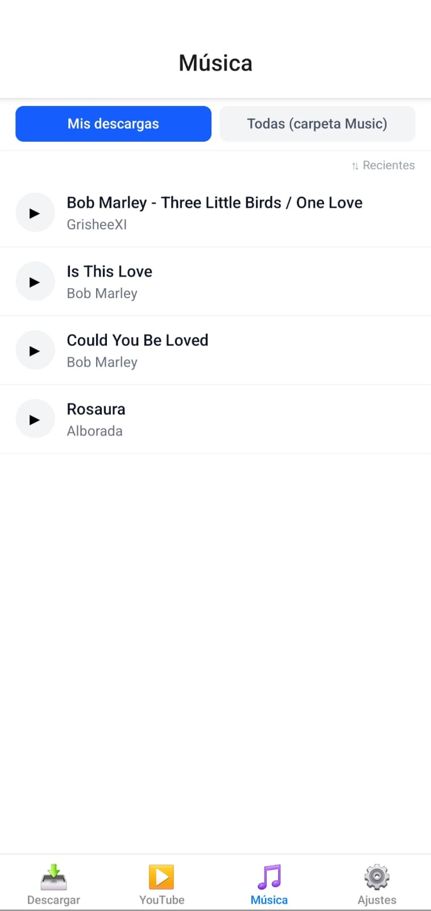
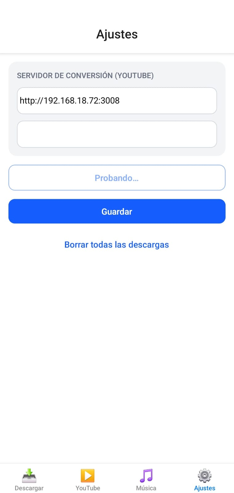
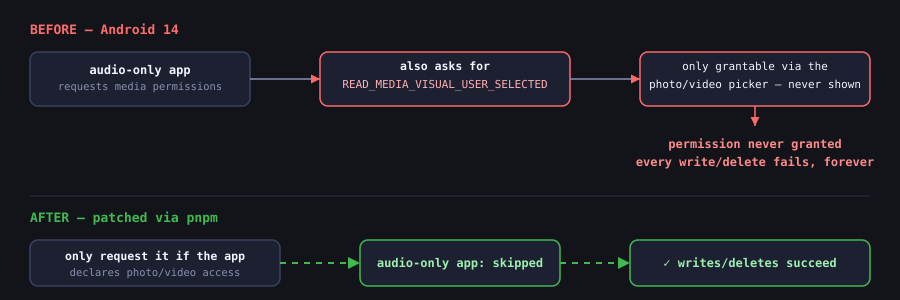

I take the same commute most days, and it's the same story every time: signal drops the second
the bus goes underground, and whatever I was streaming stutters to a halt. I've been meaning to
fix this properly for months — not with another app that "caches for offline" behind a
subscription wall, but with something dumb-simple: paste a link, get a real MP3 file, own it. This
week I finally sat down and built it. It's called **MusicDown**, and it turned into a much better
crash course on Android's media permissions than I expected.

*Quick disclaimer before I get into it: this is a hobby project, built purely for my own private
use — not a commercial product, and not an invitation to infringe anyone's copyright. If you build
something similar, respect the artists and the platforms' terms of service.*

It's two small projects talking to each other: an Expo/React Native app on the phone, and a tiny
Node server that does the actual audio conversion. Here's how it came together, screen by screen,
bug by bug.

## Why it needs a server at all

My first instinct was "how hard can it be to do this on-device?" Turns out: hard enough that I
gave up within the hour. Mobile apps can't reliably shell out to `ffmpeg` or `yt-dlp`, so the
conversion has to happen somewhere else. I kept the server deliberately boring — just Express,
no YouTube library, no database:



```js
// server.js (simplified)
const ytdlp = spawn(YTDLP_PATH, ['-f', 'bestaudio/best', '--no-playlist', '--newline', '-o', '-', url]);
const ffmpeg = spawn(FFMPEG_PATH, ['-i', 'pipe:0', '-vn', '-f', 'mp3', '-b:a', '192k', 'pipe:1']);

ytdlp.stdout.pipe(ffmpeg.stdin);
ffmpeg.stdout.pipe(res); // straight into the HTTP response, no temp files on disk
```

Nothing ever touches the server's disk — `yt-dlp`'s stdout goes straight into `ffmpeg`'s stdin,
and `ffmpeg`'s stdout goes straight into the HTTP response. The one wrinkle: since the response
body *is* the binary MP3, it can't also carry JSON progress updates. So I regex-match `yt-dlp`'s
stderr for `[download]  NN.N%`, stash it in an in-memory map keyed by a `jobId` the app generates,
and let the app poll a separate endpoint while the progress bar fills up.

| Endpoint | What it does |
| --- | --- |
| `GET /api/health` | used by the app's "Probar conexión" button |
| `GET /api/metadata?url=` | runs `yt-dlp -j`, returns title/artist/thumbnail/duration |
| `GET /api/progress?jobId=` | polled during a conversion for the progress bar |
| `GET /api/convert?url=&filename=&jobId=` | streams back `audio/mpeg` |

Auth is a single `x-api-key` header, only enforced if I actually set an `API_KEY` env var (the
server nags with a warning at boot if I forget). There's a `Dockerfile` that pulls the latest
`yt-dlp` binary straight off GitHub releases, but honestly I'm just running it on my own machine
on the home network for now — the README I wrote for it is upfront that this is for personal use,
not something to expose publicly, since re-hosting YouTube audio like this sits in a legal gray
area and there's zero rate limiting.

## Four tabs, one shared Button component

On the app side I used Expo SDK 54, `expo-router` for file-based navigation, and Nativewind
(Tailwind v4, but for React Native) for styling instead of pulling in a full UI kit. I wrote one
`Button` component with filled/outlined/text variants and reused it everywhere — partly
discipline, partly not wanting to spend the weekend picking a design system.

These are real screenshots off my phone, and it shows — this is a first working version. The
plumbing all works end to end, but I haven't touched the visual polish at all yet: default system
fonts, no icons beyond the tab bar emoji, plain white backgrounds. That part's next; for now I
just wanted to get the whole loop working.

### Descargar



The front door. Paste a link, tap the button, and it walks through fetching the metadata,
streaming the conversion, and writing the tagged MP3 to `Music/` — the button's own label doubles
as the only progress indicator right now (`Descargando…`).

### YouTube



An in-app browser (`react-native-webview`) pointed at `m.youtube.com`, with an injected ad-block
script I'm a little proud of — it hides banner elements, auto-clicks "skip ad" buttons, and for
the unskippable ones just force-seeks the video to its own duration. The **Descargar este video**
button at the bottom only lights up once the current page is actually a video URL, and reuses the
exact same download flow as the Descargar tab.

### Música



The library, with a toggle between **Mis descargas** (tracks downloaded through the app) and
**Todas (carpeta Music)** (everything already sitting in the phone's Music folder, which needs a
real device build to read). Tapping a track you downloaded opens an **edit screen** — no
screenshot of that one yet — where you can rewrite the ID3 title/artist/album and swap the cover
art, either from your gallery or by searching the iTunes Search API right there in the app.

### Ajustes



Just the server URL, the API key, a connection test button (mid-test in that screenshot — mine's
pointed at my own machine's LAN IP), and — because I will absolutely need this one day — a "delete
everything" button with a confirmation dialog.

## The part that actually ate my Saturday

Everything above came together faster than I expected. What didn't was Android's storage
permission model, which has changed enough across 11, 13, and 14 that half the blog posts I found
while debugging were already out of date.

### The Android 14 permission wall

The one that cost me the most time: on Android 14, **every write and delete to my own downloaded
files was silently failing**, with no error I could find anywhere. It took a long afternoon with
the `expo-media-library` source open in one tab and the Android permission docs in another to
figure out why.



The library's permission logic was unconditionally requesting `READ_MEDIA_VISUAL_USER_SELECTED` —
a permission that can *only* ever be granted through the photo/video partial-access picker. An
audio-only app never shows that picker, so the permission can never be granted, and every write or
delete call just fails, forever, on Android 14+. I ended up patching the library's own Kotlin
permission code (applied automatically via pnpm's `patchedDependencies`, so I don't have to
remember to reapply it) so it only asks for that permission when the app actually declares
photo/video access — which mine never does.

A few smaller ones came out of the same rabbit hole.

### No album folders

`createAlbumAsync` does raw filesystem I/O that needs a `WRITE_EXTERNAL_STORAGE` grant Android
13+ won't hand out anymore. `createAssetAsync` alone uses the modern MediaStore insert path and
drops the file straight into `Music/` without touching that wall, so I just stopped trying to
group things into albums.

### Write-only, on purpose

The app only ever creates new assets, never reads the existing library through this permission, so
it requests write-only access explicitly — which also sidesteps the granular "audio" read
permission that Expo Go doesn't even declare in its manifest.

### Deleting needs the newer API

The legacy `deleteAssetsAsync()` doesn't implement Android 11's required user-consent flow — it
can silently no-op instead of deleting anything. `expo-media-library/next`'s `Asset.delete()`
properly triggers the real system confirmation dialog.

### Why I need a real dev build, not Expo Go

Reading the whole Music folder needs `READ_MEDIA_AUDIO`, which Expo Go's fixed manifest can't
carry — only a custom development client, built with EAS, actually ships the native permissions my
config plugins add. That's why both my dev and preview EAS profiles build a plain APK for
sideloading, rather than the Play-Store AAB format.

### A broken enum

`browser-id3-writer` declares its `ImageType` as a TypeScript `const enum`, which gets erased at
compile time — but the published package ships plain JS with no runtime export for it, so
`ImageType.CoverFront` is quietly `undefined`. I just hardcoded the raw APIC picture-type byte
(`0x03`) instead, wrapped in a try/catch so one bad YouTube thumbnail can't take down an entire
download.

## Where it's at

No background downloads or notifications yet — everything runs while the Download or YouTube tab
is actually open, which is the obvious next thing to build. But as of this weekend I've got a
working pipeline from "paste a link" to "tagged MP3, real cover art, sitting in my Music app," and
a much sharper mental model of exactly where Android's permission system decides to bite you.
